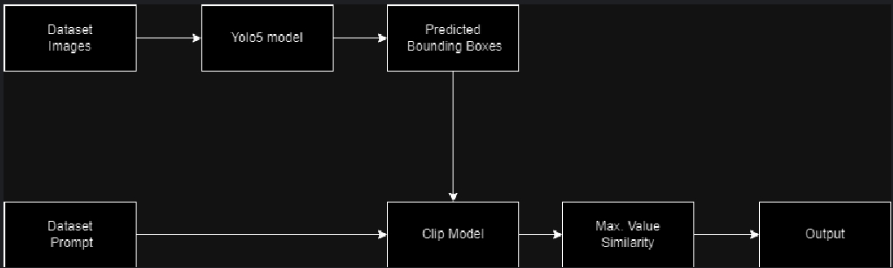

# CLIP-VisualGrounding
Deep Learning Spring 2023 Course Project @ UNITN

## Authors
- Adnan Irshad
- Hira Afzal
- Kaleem Ullah

Course: Deep Learning, Spring 2023 @ University of Trento, Italy

## Overview
This repository contains the code for the project of the Deep Learning course at UNITN. The project is about Visual Grounding as Referring Expression Comprehension (REC) using CLIP model. In this project, we delved into the domain of Visual Grounding, an intersection of computer vision and natural language processing. This project along with its report presents an in-depth dive into the journey of creating a potent framework that uses OpenAI's CLIP model with different techniques to undertake the visual grounding task & its challenges. Visual Grounding is defined as a task that seeks to link the world of language with visual perception.Having a query or prompt at hand the goad is to predict the bounding box around the object referred in that phrase, that's visual grounding in action. We tried several techniques in this project to design a system that can take a textual description and then accurately locate and highlight the described object within an image. The experiments are performed on RefCOCOg dataset. In the sections that follow, we will dive deeper into the structures, techniques, and results of our methods.

## Dataset
The dataset used in this project is RefCOCOg. It is a dataset for referring expression comprehension and a variant of the Referring Expression Generation (REG) dataset. Dataset can be access and download via [Google Drive link](https://drive.usercontent.google.com/download?id=1xijq32XfEm6FPhUb7RsZYWHc2UuwVkiq&authuser=0). Please note that in the annotations folder, there are two available refer files in the pickle format (ref(google).p and ref(umd).p). For this project, we used the second split of the dataset, which is ref(umd).p consisting of 80,000 referring expressions for 26,711 images.

## Problem Statement
An essential component of the visual grounding task is generating accurate bounding boxes precisely around each referred object in the image.  The model seeks to predict a set of bounding boxes that match the object(s) referred to in a given natural language expression by learning a mapping between the visual and textual feature vectors of the images using CLIP model as a foundation.

## CLIP Model
CLIP (Contrastive Language-Image Pretraining) is a neural network model developed by OpenAI that learns to associate images and their textual descriptions. It is trained on a large-scale dataset of images and their associated captions to predict which caption goes with which image out of a set of randomly sampled images and captions. CLIP has a vision transformer and a language transformer, which are jointly trained to understand the relationship between images and their captions using contrastive loss function, which encourages the model to assign high similarity scores to matching image-caption pairs and low similarity scores to non-matching pairs.  The model is capable of understanding a wide range of visual concepts and can be fine-tuned for a variety of tasks, including image classification, object detection, and image generation.

<br>

<p align="center">CLIP Architecture</p>

## Overall Project Structure
The project is streamlined into a modular and robust pipeline, ensuring smooth execution and ease of customization. Initially the implementation of simple baseline integrating CLIP with YOLOv5, serving as a our project's backbone in the visual grounding task. We deploy the YOLOv5 model to get all possible bboxes for objects in image. With the cropped images in hand, we use OpenAI's CLIP model to get the encoded text and vision features for each of the cropped image obtained. For each YOLOv5's result, we calculate a similarity score using Zero-shot approach. This score quantifies how well the textual query or caption matches with the content of the cropped image.

In essence, CLIP is bridging the gap between the textual description and the visual content, allowing us to determine which object in the image the textual query is referring to. Once every bbox has an associated similarity score, and a candidate with bbox with maximum similarity selected as the visual section of the image that best aligns with the given textual query. By spotlighting this region, we achieve the primary objective of **visual grounding: to locate the object described by the text within the image.**

<br>

<p align="center">Baseline Design</p>

Building upon this baseline, we examine the results, challenges and issues & ventured into various avenues to refine and optimize our baseline with different approaches.

- **Training-Free Approaches with CLIP's Zero-Shot Learning**:
  Capitalizing on CLIP's zero-shot learning capabilities, we experimented with training-free strategies. The allure here is the power of CLIP to understand and map visual-textual relationships without the need for explicit fine-tuning on our target dataset.
  *   **Baseline with Padding:** Upon experimenting with simple pipeline, we noticed that while cropping images and resizing it loosing some information and it may cause poor results. Therefore we introduced padding.

  *   **Baseline with YOLO8:** Upon Some research and curiosity we thought maybe because of speed and accuracy introduced with the recent model of yolo we might be able to get some fruitful results.
  
  *   **Baseline with DETR:** As YOLO is based on CNN models and with the recent advancement in Vision with the help of transformers we tried to test DETR model which is completely based on transformers. And also while doing some research on Visual Grounding tasks, we found a lot of researchers using DETR and also modifying it for visual grounding and image captioning.
  
  *   **Baseline + NLP (Subject Detection + ENR):** Upon Observation we noticed that the similarities of sentences and images were low very the context of object was present hence we tried to reduce the sentence into subject only with NLP techniques and in particular we used Spacy library then the subjects were compared with yolov5/8 predicted bboxes to see max similarity.

- **Fine-Tuning & Training Approaches**:
  While zero-shot learning offers a rapid deployment advantage, to push the boundaries of accuracy and precision, we also took the route of fine-tuning. This involved subtly adjusting the CLIP model, customizing it to better resonate with the nuances of the RefCOCOg dataset.
  *  **PROJECTION HEAD WITH BBOX REGRESSION LOSS:** As simplest approach we tried to test MLP projection head on concatenated features obtained from clip and passed through 4 linear layers followed by RELU activation. Due to limited resources we kept the batch size to 32 and epoch to 20.
  
  * **PROJECTION HEAD WITH BBOX REGRESSION AND IOU LOSS:** We also tried to test the model with two combined loses hoping they would perform better keeping the other parameters same.

## How to Run this Notebook
To run this notebook, need to create the environment by downloading dataset, installing the required dependencies and setting up the directories following the cells given below.

First, need to download the dataset from the provided dataset link using the `gdown` library in 'dataset' directory,  unzip the downloaded dataset using the `tar` command. This process should take only 10 minutes on Colab.

### Step 1: Download the dataset
```bash
!pip install -qqq gdown

!mkdir dataset
!cd dataset
!gdown 1xijq32XfEm6FPhUb7RsZYWHc2UuwVkiq

tar -xvf /content/refcocog.tar.gz
rm /content/refcocog.tar.gz
```

### Step 2: Install the required dependencies
```bash
!pip install -U ultralytics
!pip install git+https://github.com/openai/CLIP.git
!pip install spacy
!python -m spacy download en_core_web_lg
!python -m spacy download en_core_web_sm
!pip install tensorboard
```

## FUTURE CONSIDERATIONS

### 1. EFFICIENT FEATURE FUSION

*   During our exploration, we encountered a paper named "TransVG." Unlike conventional methods that merely concatenate features, TransVG introduces an innovative approach. It incorporates a learnable vector to grasp the relational positions of objects within the image, referenced by the prompt, through the use of transformers. This is then followed by utilizing an MLP (Multi-Layer Perceptron) for bounding box regression.
*   Considering the rigorous training of both the Clip vision and textual encoder components, the option of substituting their pretrained transformers with those of vision and text in case of utilizing Clip for this particular task appears to hold promise for yielding favorable outcomes.

* While the code associated with the paper is accessible, we decided not to pursue this avenue due to time constraints.

<br>

<p>TransVG: End-to-End Visual Grounding with Transformers</p>


### 2. Enhancing Visual Grounding with Pseudo-Queries and Text-to-Text Similarity

While working on idea of performing text-to-text similarity between extracted subject/entities and Yolo class labels, we found another idea which was generate pseudo-queries of cropped objects and perform text-to-text similarity with original caption. Below is detailed brain-storming concept of this idea:

In the realm of visual grounding, to enhance the performance and robustness of existing methods, we thought an innovative approach, utilizing pseudo-query generation techniques to create descriptive text for each detected object, our method aims to refine the textual-visual matching process. By calculating text-to-text similarity between these generated pseudo-queries and the original textual query, we aim to achieve more accurate and contextually relevant visual grounding results. This approach has the potential to revolutionize the way systems understand and interpret the interplay between text and visual data.

Here's a proposed pipeline that melds more brainstorming concepts with technical details to give this idea a solid foundation:

<br>

<p align="center">Visual Grounding with Pseudo-Queries and Text-to-Text Similarity</p>

1. Deploy advanced object detectors such as YOLOv5, YOLOv8, or DETR to an image to generate bounding boxes (bboxes) for potential objects.
2. Crop the detected objects from the main image using their respective bboxes.
3. Implement padding strategies to ensure that cropped images, especially smaller objects, do not become distorted or lose content.
4. For each cropped image, generate a pseudo-query or caption that describes the object in the cropped image.
5. The method from "Pseudo-Q: Generating Pseudo Language Queries for Visual Grounding" can be used.
   * This approach focuses on generating queries that are likely to be used by users in referring expressions.
   * Alternatively, "ClipCap: CLIP Prefix for Image Captioning" can be employed. This leverages the CLIP model's capabilities to produce relevant captions for images.
6. With the generated pseudo-queries or captions at hand, calculate the similarity between each pseudo-query and the original referring expression (query) provided for the image.
   * Deploy the CLIP text model, which is designed to understand semantic content and is thus apt for this purpose.
   * Another option is to use BERT (or its variants like RoBERTa or DistilBERT) which is a transformer-based model tailored for text applications and can compute high-quality semantic embeddings.
7. Based on the calculated text-to-text similarities, select the cropped image corresponding to the pseudo-query that has the highest similarity score with the original text. This cropped image should ideally be the correct visual grounding for the original query.


Our Thoughts on this approach: By generating pseudo-queries, the system has a more informed basis to compare with the original referring expressions, thereby potentially improving the accuracy and robustness of visual grounding tasks. Integrating these methodologies could pave the way for a more intelligent and context-aware visual grounding system.

However, due to limited resources and time constraint we are not able to implement this strategy but based on research on this idea we're pretty sure that this approach may provide good results.


## References
* [Learning Transferable Visual Models From Natural Language Supervision](https://arxiv.org/abs/2103.00020)
* [YoloV5](https://github.com/ultralytics/yolov5)
* [YoloV8](https://github.com/ultralytics/ultralytics)
* [Dynamic MDETR: A Dynamic Multimodal Transformer Decoder for Visual Grounding](https://arxiv.org/abs/2209.13959)
* [End-to-End Object Detection with Transformers](https://arxiv.org/abs/2005.12872)
* [MDETR -- Modulated Detection for End-to-End Multi-Modal Understanding](https://arxiv.org/abs/2104.12763)
* [CORA: Adapting CLIP for Open-Vocabulary Detection with Region Prompting and Anchor Pre-Matching](https://arxiv.org/pdf/2303.13076.pdf)
* [TransVG: End-to-End Visual Grounding with Transformers](https://arxiv.org/abs/2104.08541)
* [CLIP-VG: Self-paced Curriculum Adapting of CLIP for Visual Grounding](https://arxiv.org/abs/2305.08685)
* [Pseudo-Q: Generating Pseudo Language Queries for Visual Grounding](https://arxiv.org/pdf/2203.08481.pdf)